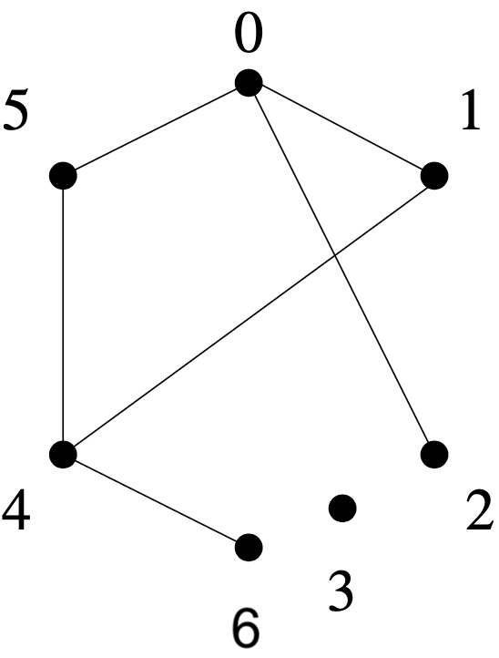

# Project - Operations Research and Big Data
>**Emma DEMARECAUX - Charles DESALEUX**
************************

As an example, we uses the small graph `tuto_graph.txt` throughout the code description. It contains 7 nodes, numbered from 0 to 6, and the following edges: 0-1, 0-2, 0-5, 1-4, 4-5, 4-6. Here is a representation of the graph:



# Part 1: Handling a large graph

Change the current working directory to `part1`:
```
cd part1
```

## LoadGraph

These programs read a graph and store it in memory as:

* a list of edges;
* an adjacency matrix;
* an adjacency list.

### To compile:

```
gcc ./LoadGraph/edgelist.c -O3 -o ./LoadGraph/edgelist
```
```
gcc ./LoadGraph/adjmatrix.c -O3 -o ./LoadGraph/adjmatrix
```
```
gcc ./LoadGraph/adjarray.c -O3 -o ./LoadGraph/adjarray
```

### To execute:

Each program expects an argument `edgelist.txt` that should contain the graph: one edge on each line (two unsigned long (nodes' ID) separated by a space). The program will load the graph in main memory and then terminate. As an example, one can run the following commands:

```
./LoadGraph/edgelist graphs/tuto_graph.txt
```
```
./LoadGraph/adjmatrix graphs/tuto_graph.txt
```
```
./LoadGraph/adjarray graphs/tuto_graph.txt
```

### Note

If the graph is directed (and weighted) with self-loops and you want to make it undirected unweighted without self-loops, use the following command line.  

```
awk '{if ($1<$2) print $1" "$2;else if ($2<$1) print $2" "$1}' graph.txt | sort -n -k1 -k2 -u > undirected-graph.txt
```

## Connected components

The program will load the graph in main memory and return the number of connected components as well as the fraction of nodes in the largest component.

### To compile:

```
gcc connected_components.c -O3 -o connected_components
```

### To execute:

The program expects the following arguments:
 
 * `edgelist.txt` that should contain the graph: one edge on each line (two unsigned long (nodes' ID) separated by a space); 
 * `results.txt` for writing the results.
 
As an example, one can run the following command:

```
./connected_components graphs/tuto_graph.txt results/tuto_cc.txt
```

## Diameter

The program will load the graph in main memory and compute a good lower bound to the diameter of a graph.

### To compile:

```
gcc diameter.c -O3 -o diameter
```

### To execute:

The program expects the following arguments: `edgelist.txt` that should contain the graph: one edge on each line (two unsigned long (nodes' ID) separated by a space); 
 
As an example, one can run the following command:

```
./diameter graphs/tuto_graph.txt
```

## Triangles

The program will load the graph in main memory and return its list of triangles along with the number of triangles.

### To compile:

```
gcc triangles.c -O3 -o triangles
```

### To execute:

The program expects the following arguments:
 
 * `edgelist.txt` that should contain the graph: one edge on each line (two unsigned long (nodes' ID) separated by a space); 
 * `results.txt` for writing the results.
 
As an example, one can run the following command:

```
./triangles graphs/tuto_graph.txt results/tuto_triangles.txt
```

# Part 2

Change the current working directory to `part2`:
```
cd part2
```

## PageRank

The program is the implementation of PageRank using the power iteration method.

### To compile:

```
gcc page_rank.c -O3 -o page_rank
```

### To execute:

The program expects the following arguments:
 
 * `edgelist.txt` that should contain the graph: one edge on each line (two unsigned long (nodes' ID) separated by a space); 
 * `page_names.txt` that should contain a mapping between a node ID and a name;
 * `degrees.txt` for writing the degree out of each node;
 * `results.txt` for writing the results of the PageRank algorithm.

As an example, one can run the following command:

```
./page_rank graphs/tuto_graph.txt graphs/tuto_names.txt results/tuto_degrees_out.txt results/tuto_pagerank.txt
```

## Correlations

The program is the implementation of PageRank using the power iteration method.

### To compile:

```
gcc correlations.c -O3 -o correlations
```

### To execute:

The program expects the following arguments:
 
 * `edgelist.txt` that should contain the graph: one edge on each line (two unsigned long (nodes' ID) separated by a space); 
 * `degrees_out.txt` for writing the degree out of each node;
 * `degrees_in.txt` for writing the degree in of each node;
 * `results.txt` for writing the results of the PageRank algorithm.

As an example, one can run the following command:

```
./correlations graphs/tuto_graph.txt results/tuto_degrees_out.txt results/tuto_degrees_in.txt results/tuto_correlations_0_15.txt
```

If one want to look at the following correlations for the [Wikipedia](http://cfinder.org/wiki/?n=Main.Data#toc1) dataset:


* x = PageRank with α = 0.15, y = in-degree;
* x = PageRank with α = 0.15, y = out-degree;
* x = PageRank with α = 0.15, y = PageRank with α = 0.1; 
* x = PageRank with α = 0.15, y = PageRank with α = 0.2;
* x = PageRank with α = 0.15, y = PageRank with α = 0.5;
* x = PageRank with α = 0.15, y = PageRank with α = 0.9.

one can first collect the results from the file `correlation.c` and then run

```
python3 correlations.py
```

## k-core decomposition

The program is the implementation of the core decomposition algorithm.

### To compile:

```
gcc k-core.c -O3 -o k-core
```

### To execute:

The program expects the following arguments:
 
 * `edgelist.txt` that should contain the graph: one edge on each line (two unsigned long (nodes' ID) separated by a space); 
 * `degrees.txt` for writing the degree of each node;
 * `results.txt` for writing the results of the PageRank algorithm.

As an example, one can run the following command:

```
./k-core graphs/tuto_graph.txt results/tuto_degrees.txt results/tuto_k-core.txt
```

## Graph mining with k-core

After running the k-core algorithm, the program makes a plot degree/coreness using Python:

### To execute:

```
python3 k-core_plot.py 
```

Using the google scholar dataset, the result is `figures/net_coreness_degree.png` that represents the graph.


# Part 3

Change the current working directory to `part3`:
```
cd part3
```

## Generate random graphs

The program generates the following random graphs using Python:

 * The graph has 400 nodes partition into 4 clusters of 100 nodes;
 * Each pair of nodes in the same cluster is connected with a probability p;
 * Each pair of nodes in different clusters is connected with a probability q 􏰀<= p.

### To execute:

```
python3 random_graph.py 
```

The results are for instance:

 * `graphs/random9_p0.9_q0.1.txt` that should contain the graph: one edge on each line (two unsigned long (nodes' ID) separated by a space); 
 * `results/random9_p0.9_q0.1_clusters.txt` that should contain the true cluster partition: one node and its cluster id on each line;
 * `figures/random9_p0.9_q0.1.png` that represents the graph and color the nodes using a different color for each cluster.

## Label propagation

The program is the implementation of the label propagation algorithm.

### To compile:

```
gcc label_propagation.c -O3 -o label_propagation
```

### To execute:

The program expects the following arguments:
 
 * `edgelist.txt` that should contain the graph: one edge on each line (two unsigned long (nodes' ID) separated by a space); 
 * `results.txt` for writing the resulting partition: one node and its community id on each line.

As an example, one can run the following command:

```
./label_propagation graphs/random9_p0.9_q0.1.txt results/random9_communities.txt
```

To draw the graph and color the nodes using a different color for each community with Python, `draw_graph_community.py` expects the following arguments:
 
 * `edgelist.txt` that should contain the graph: one edge on each line (two unsigned long (nodes' ID) separated by a space); 
 * `results.txt` that should contain the resulting partition: one node and its community id on each line.

As an example, one can run the following command:

```
python3 draw_graph_community.py graphs/random9_p0.9_q0.1.txt results/random9_communities.txt
```

The result is for instance `figures/random9_p0.9_q0.1_labels.png` that represents the graph and color the nodes using a different color for each community.


# Credits
>**Maximilien DANISCH** http://bit.ly/danisch http://github.com/maxdan94/LoadGraph
